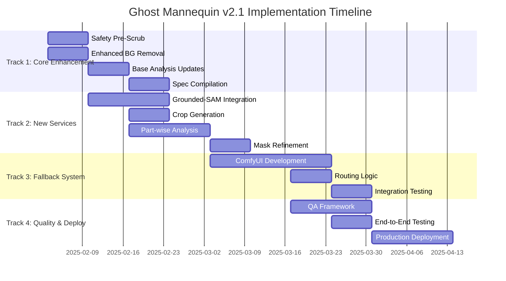

# Ghost Mannequin Pipeline v2.1 Implementation Plan
**Generated**: January 21, 2025  
**Project**: AI-Powered Ghost Mannequin Pipeline Enhancement  
**Timeline**: 10 Weeks (February - April 2025)

---

## Executive Summary

This implementation plan transforms the Ghost Mannequin Pipeline from v1.0 (6-stage) to v2.1 (11-stage) with enhanced quality, fail-safe reliability, and agency-grade output. The plan uses a **systematic strategy** with **parallel development tracks** to minimize risk while delivering aggressive timeline targets.

### Key Objectives
- **Enhanced Quality**: ≥95% commercial acceptability with ΔE≤3 color accuracy
- **Fail-Safe Reliability**: ComfyUI fallback system for guaranteed output
- **Performance**: ≤4 minutes processing time (vs current 4-8 seconds)
- **Cost Efficiency**: Maintain ~$0.08-0.09 per image cost target

---

## Strategic Approach

### Multi-Track Development Strategy

### Risk Mitigation Benefits
- **Parallel Development**: Independent tracks reduce critical path dependencies
- **Incremental Integration**: Core enhancements can be deployed independently  
- **Fallback Strategy**: ComfyUI track isolated to minimize overall project risk
- **Quality Gates**: Automated validation prevents regression and ensures progress

---

## Epic-Level Task Breakdown

### Epic 1: Enhanced Core Pipeline (Weeks 1-4)
**Objective**: Upgrade existing pipeline stages with enhanced capabilities

#### Story 1.1: Safety Pre-Scrub Implementation
- **Week 1 Priority**: Critical foundation for all downstream processing
- **Tasks**:
  - Implement human pixel detection using computer vision
  - Create edge erosion algorithms (≤3px precision)
  - Build preservation logic for garment pixels
  - Develop safety threshold validation (skin_area >50%)
- **Acceptance Criteria**: ≥98% human pixel detection accuracy
- **Owner**: Backend Engineer + ML Engineer

#### Story 1.2: Enhanced Background Removal
- **Week 1-2 Priority**: Foundation service upgrade
- **Tasks**:
  - Integrate `fal-ai/birefnet` as primary service
  - Implement parallel processing for dual images
  - Add edge smoothness validation
  - Create artifact detection and correction
- **Acceptance Criteria**: ≤2px edge variance improvement over v1.0
- **Owner**: Backend Engineer

#### Story 1.3: Base Analysis Schema Updates  
- **Week 2-3 Priority**: Schema evolution for new capabilities
- **Tasks**:
  - Extend analysis schema with fabric properties
  - Add segmentation planning logic
  - Implement crop boundary definitions
  - Ensure 100% backward compatibility
- **Acceptance Criteria**: Schema validation with regression testing
- **Owner**: Backend Engineer

#### Story 1.4: Spec Compilation Enhancement
- **Week 3-4 Priority**: Data integration optimization
- **Tasks**:
  - Design multi-source data merger
  - Implement conflict resolution logic
  - Create compiled specification format
  - Add validation and quality checks
- **Acceptance Criteria**: Successful compilation of all analysis stages
- **Owner**: Backend Engineer

### Epic 2: Advanced Segmentation System (Weeks 2-6)
**Objective**: Implement precision segmentation and part-wise analysis

#### Story 2.1: Grounded-SAM Service Integration
- **Week 2-4 Priority**: Critical path dependency
- **Tasks**:
  - Research and integrate Grounded-SAM API
  - Implement instance-based segmentation logic
  - Create prompt generation from base analysis
  - Add quality validation (≥95% accuracy)
- **Acceptance Criteria**: Successful segmentation with precision requirements
- **Owner**: ML Engineer + Backend Engineer

#### Story 2.2: Crop Generation Framework
- **Week 3-4 Priority**: Depends on segmentation
- **Tasks**:
  - Implement strategic crop algorithms (neck, sleeve, hem, placket)
  - Create adaptive crop sizing based on garment type
  - Add high-resolution preservation logic
  - Implement context padding for edge analysis
- **Acceptance Criteria**: Automated crop boundary validation
- **Owner**: Backend Engineer

#### Story 2.3: Part-wise Analysis Modules
- **Week 4-5 Priority**: Detailed analysis capability
- **Tasks**:
  - Develop neck analysis module (shape, depth, collar)
  - Create sleeve analysis module (length, cuff, opening)
  - Implement hem analysis module (finish, length)
  - Build placket analysis module (closure, spacing)
- **Acceptance Criteria**: JSON schema compliance for all 4 modules
- **Owner**: Backend Engineer + ML Engineer

#### Story 2.4: Mask Refinement Algorithms
- **Week 5-6 Priority**: Final processing optimization
- **Tasks**:
  - Implement proportion-aware geometric transformations
  - Create cavity carving algorithms (neck, sleeves, placket)
  - Add symmetry validation (≥95% accuracy)
  - Implement edge smoothness optimization
- **Acceptance Criteria**: Geometric consistency validation
- **Owner**: ML Engineer

### Epic 3: Generation Enhancement (Weeks 3-7)
**Objective**: Optimize primary generation path with advanced controls

#### Story 3.1: Flash Generation Optimization
- **Week 3-5 Priority**: Core generation capability
- **Tasks**:
  - Implement transport guardrails (≤8MB, ≤2048px)
  - Add deterministic seeding (batch consistency)
  - Create optimized prompt engineering
  - Implement bounded retry logic (max 1 retry)
- **Acceptance Criteria**: ≤20 second processing time target
- **Owner**: Backend Engineer

#### Story 3.2: Transport Guardrails Implementation
- **Week 4-5 Priority**: Reliability and policy compliance
- **Tasks**:
  - Create automatic image downscaling
  - Implement JPEG compression optimization (q≈86)
  - Add public URL generation for all reference images
  - Create size validation and enforcement
- **Acceptance Criteria**: ≤8MB image size validation
- **Owner**: Backend Engineer

#### Story 3.3: Multi-Scale Appearance Control
- **Week 5-6 Priority**: Advanced quality control
- **Tasks**:
  - Implement multi-scale control framework
  - Create fine-grained appearance control logic
  - Add texture preservation from flatlay source
  - Implement lighting consistency controls
- **Acceptance Criteria**: Quality validation with ΔE≤3 color accuracy
- **Owner**: ML Engineer

#### Story 3.4: Prompt Engineering Refinement
- **Week 6-7 Priority**: Output quality optimization
- **Tasks**:
  - Design compact prompt structure (<700 chars fallback)
  - Implement policy-safe header generation
  - Create context-aware prompt adaptation
  - Add label preservation logic integration
- **Acceptance Criteria**: Performance benchmarking vs v1.0 baseline
- **Owner**: ML Engineer + Backend Engineer

### Epic 4: Fallback System (Weeks 5-9)
**Objective**: Implement ComfyUI fallback for guaranteed output

#### Story 4.1: ComfyUI Pipeline Development
- **Week 5-7 Priority**: Independent development track
- **Tasks**:
  - Install and configure ComfyUI environment
  - Implement ControlNet stack (Depth, SoftEdge, Tile)
  - Create IP-Adapter integration with Reference-Only mode
  - Develop img2img processing with low denoise (0.15-0.35)
- **Acceptance Criteria**: Successful installation and basic operation
- **Owner**: ML Engineer + DevOps Engineer

#### Story 4.2: Routing Logic Implementation
- **Week 7-8 Priority**: Integration logic
- **Tasks**:
  - Create fallback trigger conditions detection
  - Implement automatic routing decision logic
  - Add human skin percentage threshold enforcement
  - Create quality validation failure detection
- **Acceptance Criteria**: 100% fallback activation when conditions met
- **Owner**: Backend Engineer

#### Story 4.3: Quality Validation Integration
- **Week 8 Priority**: End-to-end integration
- **Tasks**:
  - Integrate ComfyUI output with QA framework
  - Create sRGB color space validation
  - Add resolution verification (≥2000px)
  - Implement output format standardization
- **Acceptance Criteria**: Output quality meets production standards
- **Owner**: QA Engineer + Backend Engineer

#### Story 4.4: Performance Optimization
- **Week 8-9 Priority**: Production readiness
- **Tasks**:
  - Optimize GPU utilization (24-48GB VRAM)
  - Implement processing time optimization (≤150s target)
  - Add resource monitoring and alerting
  - Create performance benchmarking suite
- **Acceptance Criteria**: ≤150 second processing time target
- **Owner**: DevOps Engineer + ML Engineer

### Epic 5: Quality Assurance Framework (Weeks 7-10)
**Objective**: Comprehensive quality validation and production deployment

#### Story 5.1: Enhanced QA Metrics
- **Week 7-8 Priority**: Quality framework foundation
- **Tasks**:
  - Implement color accuracy validation (ΔE≤3)
  - Create edge quality assessment (<2px variance)
  - Add symmetry analysis (≥95% accuracy)
  - Implement background uniformity checks (≥98%)
- **Acceptance Criteria**: All metrics automated and validated
- **Owner**: QA Engineer

#### Story 5.2: Automated Validation Systems
- **Week 8 Priority**: Automation and efficiency
- **Tasks**:
  - Create automated test suite for all pipeline stages
  - Implement regression testing framework
  - Add performance monitoring dashboard
  - Create quality metrics tracking and alerting
- **Acceptance Criteria**: 100% test suite pass rate
- **Owner**: QA Engineer + DevOps Engineer

#### Story 5.3: End-to-End Testing
- **Week 8-9 Priority**: System validation
- **Tasks**:
  - Execute comprehensive end-to-end testing
  - Validate all quality gates and acceptance criteria
  - Perform stress testing with concurrent requests
  - Execute cost validation and optimization
- **Acceptance Criteria**: Performance and cost targets met
- **Owner**: QA Engineer + All Team

#### Story 5.4: Production Deployment
- **Week 9-10 Priority**: Go-live preparation
- **Tasks**:
  - Implement gradual rollout strategy (10% → 50% → 100%)
  - Create monitoring and alerting systems
  - Prepare rollback procedures and disaster recovery
  - Complete technical and user documentation
- **Acceptance Criteria**: Successful production deployment
- **Owner**: DevOps Engineer + Product Manager

---

## Quality Gates & Success Criteria

### Stage-Specific Quality Gates

| Epic | Stage | Quality Gate | Target Metric |
|------|-------|--------------|---------------|
| 1 | Safety Pre-Scrub | Human pixel detection | ≥98% accuracy |
| 1 | Background Removal | Edge quality | ≤2px variance improvement |
| 1 | Base Analysis | Schema validation | 100% backward compatibility |
| 2 | Grounded-SAM | Segmentation accuracy | ≥95% on test dataset |
| 2 | Part-wise Analysis | Schema compliance | 100% for all 4 modules |
| 2 | Mask Refinement | Symmetry accuracy | ≥95% validation |
| 3 | Flash Generation | Processing time | ≤20 seconds target |
| 3 | Transport Optimization | Image size | ≤8MB validation |
| 3 | Quality validation | Color accuracy | ΔE≤3 on test set |
| 4 | ComfyUI Integration | Basic operation | Successful installation |
| 4 | Routing Logic | Fallback activation | 100% when triggered |
| 4 | Performance | Processing time | ≤150 seconds target |
| 5 | QA Framework | Automation | All metrics automated |
| 5 | End-to-End Testing | Test coverage | 100% suite pass rate |
| 5 | Production | Deployment | 99.5% uptime target |

### Overall Success Criteria
- **Quality**: ≥95% commercial acceptability rating
- **Performance**: ≤4 minutes average processing time
- **Reliability**: ≥98% completion rate  
- **Cost**: ≤$0.10 per image (including fallback)
- **Brand Preservation**: 100% retention for critical elements

---

## Risk Management & Mitigation

### High-Risk Items & Mitigation Strategies

#### Risk 1: ComfyUI Integration Failure
- **Probability**: Medium | **Impact**: High
- **Mitigation**: 
  - Develop simplified fallback using enhanced Gemini Flash retry
  - Research alternative stable diffusion platforms
  - Isolate ComfyUI development in separate track
- **Contingency**: Enhanced Gemini Flash with advanced retry logic
- **Timeline Impact**: -2 weeks if ComfyUI abandoned

#### Risk 2: Grounded-SAM Service Unavailable/Expensive
- **Probability**: Low | **Impact**: High  
- **Mitigation**:
  - Research alternative segmentation services early
  - Develop traditional CV segmentation backup
  - Negotiate service level agreements
- **Contingency**: Enhanced traditional segmentation with existing tools
- **Timeline Impact**: -1 week for alternative integration

#### Risk 3: Performance Degradation (11-Stage Pipeline)
- **Probability**: Medium | **Impact**: Medium
- **Mitigation**:
  - Implement parallel processing optimization
  - Create stage caching and result reuse
  - Add configurable pipeline depth options
- **Contingency**: Optional stage activation for performance tuning
- **Timeline Impact**: +1 week for optimization work

#### Risk 4: Cost Overruns with New Services
- **Probability**: Medium | **Impact**: Medium
- **Mitigation**:
  - Implement usage monitoring and budget controls
  - Compare multiple service providers
  - Create staged rollout with cost validation
- **Contingency**: Service provider switching or feature reduction
- **Timeline Impact**: No timeline impact (operational decision)

### Dependency Risk Management
- **Critical Path**: Grounded-SAM integration → Start week 2 immediately
- **Independent Path**: ComfyUI development → Isolated development track
- **Integration Point**: QA framework → Requires all components by week 7

---

## Resource Requirements

### Team Composition
- **2-3 Backend Engineers**: Pipeline development, service integration, API design
- **1 ML Engineer**: Grounded-SAM, ComfyUI integration, algorithm development
- **1 QA Engineer**: Testing framework, validation, quality metrics
- **1 DevOps Engineer**: Deployment, monitoring, performance optimization  
- **1 Product Manager**: Coordination, requirements validation, stakeholder communication

### Infrastructure Requirements
- **Development Environment**: Enhanced with ComfyUI capabilities
- **GPU Resources**: 24-48GB VRAM for ComfyUI development and testing
- **API Access**: Grounded-SAM, enhanced FAL.AI, Gemini Pro/Flash quotas
- **Monitoring Tools**: Performance tracking, cost monitoring, quality dashboards
- **Testing Infrastructure**: Automated testing pipeline, regression suite

### Budget Allocation
- **Development Costs**: Team salaries and infrastructure (~$150K for 10 weeks)
- **API Service Costs**: Enhanced quotas and new service integrations (~$5K)
- **Infrastructure Costs**: GPU resources and development environments (~$10K)
- **Total Project Budget**: ~$165K for v2.1 enhancement

---

## Success Metrics & KPIs

### Primary Metrics
- **Quality Score**: ≥95% commercial acceptability (target: 98%)
- **Processing Time**: ≤4 minutes average (stretch: 3 minutes)
- **Success Rate**: ≥98% completion rate (target: 99.5%)
- **Cost Efficiency**: ≤$0.10 per image (target: $0.08)

### Secondary Metrics  
- **Fallback Usage**: ≤15% of total processing (target: 10%)
- **Color Accuracy**: ΔE≤3 for 95% of outputs (target: 98%)
- **Brand Preservation**: 100% retention for specified elements
- **System Uptime**: ≥99.5% availability (target: 99.9%)

### Business Impact Metrics
- **ROI**: 10x cost advantage vs traditional photography
- **Market Adoption**: 1000+ processed images per month
- **Customer Satisfaction**: ≥4.5/5.0 rating (target: 4.8/5.0)
- **Revenue Impact**: $50K+ monthly processing volume

---

## Deployment Strategy

### Phased Rollout Plan

#### Phase 1: Internal Testing (Week 9)
- **Scope**: Development team and QA validation
- **Criteria**: All quality gates passed, basic functionality verified
- **Rollback**: Immediate return to v1.0 if critical issues detected

#### Phase 2: Limited Beta (Week 9-10)
- **Scope**: 10% of production traffic, selected customers
- **Criteria**: Performance metrics within targets, cost validation
- **Monitoring**: Real-time quality metrics, customer feedback collection

#### Phase 3: Gradual Expansion (Week 10)
- **Scope**: 50% of production traffic, broader customer base
- **Criteria**: Consistent performance, positive customer feedback
- **Optimization**: Fine-tuning based on real usage patterns

#### Phase 4: Full Production (Week 10+)
- **Scope**: 100% of production traffic, all customers
- **Criteria**: All success metrics achieved, system stability confirmed
- **Monitoring**: Continuous performance monitoring, cost tracking

### Rollback Procedures
- **Immediate Rollback**: Single-click return to v1.0 for critical issues
- **Component Rollback**: Selective stage disabling for partial failures
- **Data Preservation**: All processing history and customer data protected
- **Communication Plan**: Customer notification and status updates

---

## Conclusion

This implementation plan provides a systematic, risk-mitigated approach to delivering Ghost Mannequin Pipeline v2.1 within a 10-week timeline. The multi-track development strategy minimizes critical path dependencies while ensuring high-quality delivery.

**Key Success Factors:**
- **Parallel Development**: Reduces risk and accelerates delivery
- **Quality Gates**: Ensures systematic progress and prevents regression
- **Risk Mitigation**: Comprehensive contingency planning for high-risk components
- **Incremental Deployment**: Safe production rollout with rollback capabilities

The plan balances ambitious technical goals with practical delivery constraints, providing a clear roadmap to achieve agency-grade ghost mannequin generation capabilities while maintaining cost efficiency and system reliability.

---

**Plan Prepared By:** AI Engineering Team  
**Review Required By:** Engineering Leadership, Product Management  
**Approval Authority:** CTO, VP Engineering  
**Next Review Date:** February 7, 2025 (Week 2 Checkpoint)