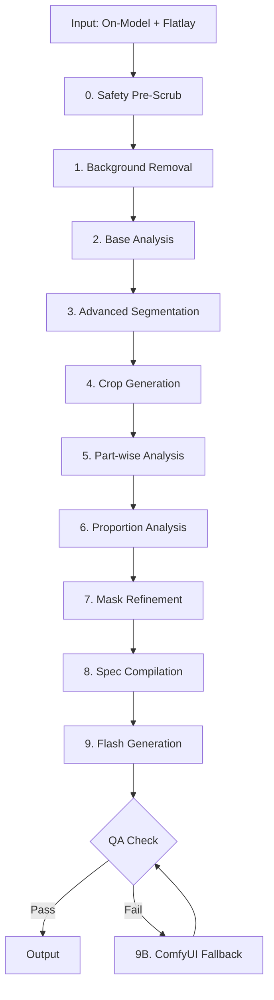

# Product Requirements Document (PRD)
# Ghost Mannequin Pipeline v2.1 Enhancement

**Document Version:** 2.1  
**Date:** January 21, 2025  
**Project:** AI-Powered Ghost Mannequin Pipeline  
**Team:** Fashion AI Engineering  

---

## 1. Executive Summary

### 1.1 Project Overview
The Ghost Mannequin Pipeline v2.1 represents a significant evolution of our AI-powered product photography system, transforming flatlay garment photos into professional ghost mannequin images suitable for e-commerce platforms. This enhancement introduces advanced multi-stage processing, enhanced quality assurance, and fail-safe routing to achieve agency-grade output quality.

### 1.2 Business Context
Fashion e-commerce demands consistent, high-quality product imagery that showcases garments in a dimensional, professional manner. Traditional ghost mannequin photography is expensive, time-consuming, and requires specialized equipment. Our AI pipeline democratizes this capability while maintaining commercial-grade quality standards.

### 1.3 Success Metrics
- **Processing Time**: ≤8 minutes per garment (current: 4-8 seconds)
- **Quality Score**: ≥95% commercial acceptability
- **Cost Efficiency**: ~$0.08-0.09 per image (vs $25-50 traditional photography)
- **Color Accuracy**: ΔE ≤3 (professional photography standard)
- **Label Preservation**: 100% retention for critical brand elements

---

## 2. Problem Statement

### 2.1 Current Limitations
**V1.0 Challenges:**
- Limited segmentation precision for complex garments
- Inconsistent proportional accuracy across different garment types
- Single-model dependency (Gemini Flash) creates failure points
- Insufficient quality validation for commercial deployment
- Basic label preservation without spatial precision

### 2.2 Market Requirements
- **Agency-Grade Quality**: Output must match professional photography standards
- **Brand Compliance**: Critical logos, labels, and text must be preserved pixel-perfect
- **Scale Operations**: Support for high-volume batch processing
- **Fail-Safe Reliability**: Guaranteed output even under challenging conditions
- **Cost Optimization**: Maintain competitive processing costs

---

## 3. Solution Architecture

### 3.1 Enhanced Pipeline Overview



### 3.2 Key Architectural Principles

#### 3.2.1 Multi-Modal AI Integration
- **Gemini Pro**: Structural analysis and part-wise detail extraction
- **Gemini Flash**: Primary image generation with prompt optimization
- **ComfyUI**: Fallback generation for policy-sensitive content
- **Grounded-SAM**: Instance-based segmentation for geometric precision

#### 3.2.2 Fail-Safe Design
- **Primary Path**: Gemini Flash (fast, cost-effective)
- **Fallback Path**: ComfyUI (guaranteed output, higher fidelity)
- **Bounded Retry**: Maximum 1 retry before fallback activation
- **Quality Gates**: Automated validation at each stage

#### 3.2.3 Data Integrity Framework
- **Image A (On-Model)**: Proportions and spatial relationships
- **Image B (Flatlay)**: Ground truth for colors, patterns, textures
- **Safety Pre-Processing**: Automatic human pixel removal
- **Transport Guardrails**: Optimized image delivery (≤8MB, ≤2048px)

---

## 4. Detailed Feature Specifications

### 4.1 Stage 0: Safety Pre-Scrub (NEW)

#### 4.1.1 Objectives
- Minimize AI policy violations
- Eliminate human pixels while preserving garment integrity
- Enable safe processing of on-model reference images

#### 4.1.2 Technical Implementation
```json
{
  "skin_detection": {
    "target_regions": ["face", "hands", "arms", "neck", "hair", "jewelry"],
    "edge_erosion": "≤3px",
    "preservation_priority": ["garment_pixels", "semi_sheer_fabric", "prints"]
  },
  "safety_threshold": {
    "skin_area_percentage": 0.5,
    "action_if_exceeded": "flatlay_only_mode"
  }
}
```

#### 4.1.3 Outputs
- `a_mask.png`: Human pixel mask
- `a_personless.png`: Clean on-model image
- `safety_metrics.json`: Processing statistics

### 4.2 Stage 1: Enhanced Background Removal

#### 4.2.1 Model Selection
- **Primary**: `fal-ai/birefnet` (improved edge precision)
- **Fallback**: `fal-ai/bria/background/remove`
- **Processing**: Parallel processing for both input images

#### 4.2.2 Quality Validation
- Edge smoothness analysis
- Transparency channel verification
- Artifact detection and correction

### 4.3 Stage 2: Base Structural Analysis

#### 4.3.1 Enhanced Analysis Schema
```json
{
  "garment_category": "shirt|dress|pants|jacket|accessory",
  "closure_type": "button|zip|pullover|wrap",
  "neckline_style": "crew|v_neck|scoop|high_neck|off_shoulder",
  "sleeve_configuration": "short|long|3_quarter|sleeveless|cap",
  "fabric_properties": {
    "weight": "light|medium|heavy",
    "structure": "woven|knit|non_woven",
    "stretch": "none|low|medium|high"
  }
}
```

#### 4.3.2 Segmentation Planning
- Generate prompts for Grounded-SAM
- Define cavity regions (neck, sleeves, hem)
- Establish crop boundaries for detailed analysis

### 4.4 Stage 3: Advanced Instance-Based Segmentation

#### 4.4.1 Grounded-SAM Integration
```json
{
  "segmentation_approach": "instance_based",
  "mask_components": {
    "primary": "garment_boundary",
    "secondary": ["neck_cavity", "sleeve_openings", "hem_boundary", "placket_line"]
  },
  "precision_requirements": {
    "edge_accuracy": "≤2px deviation",
    "cavity_symmetry": "≥95%",
    "boundary_completeness": "100%"
  }
}
```

#### 4.4.2 Quality Metrics
- Mask completeness verification
- Edge smoothness analysis
- Geometric consistency validation

### 4.5 Stage 4: Strategic Crop Generation

#### 4.5.1 Crop Strategy
- **Neck Crop**: Top 20-25% for collar and neckline analysis
- **Sleeve Crops**: Left/right sleeve regions with cuff details
- **Hem Crop**: Bottom 15-20% for finish and length analysis
- **Placket Crop**: Central vertical strip for button/zip details

#### 4.5.2 Crop Optimization
- Adaptive crop sizing based on garment type
- High-resolution preservation for critical details
- Context padding for edge analysis

### 4.6 Stage 5: Part-Wise Detail Analysis

#### 4.6.1 Specialized Analysis Modules
```json
{
  "neck_analysis": {
    "shape_profile": "round|v_shaped|square|boat",
    "depth_measurement": "shallow|medium|deep",
    "collar_presence": true,
    "seam_visibility": "hidden|topstitched|bound"
  },
  "sleeve_analysis": {
    "length_category": "cap|short|3_quarter|long",
    "cuff_style": "none|ribbed|hemmed|cuffed",
    "opening_shape": "fitted|loose|elastic"
  }
}
```

#### 4.6.2 Detail Preservation Mapping
- Label position tracking with pixel coordinates
- Logo spatial mapping for brand consistency
- Hardware element cataloging (buttons, zippers, snaps)

### 4.7 Stage 6: Proportional Model Analysis

#### 4.7.1 Human-Form Extraction
```json
{
  "model_proportions": {
    "shoulder_width_ratio": 0.24,
    "torso_length_ratio": 0.55,
    "sleeve_length_ratio": 0.48,
    "fit_classification": "slim|regular|relaxed|oversized"
  }
}
```

#### 4.7.2 Fit Assessment
- Garment-to-body relationship analysis
- Drape and flow pattern recognition
- Proportional scaling for ghost mannequin effect

### 4.8 Stage 7: Proportion-Aware Mask Refinement

#### 4.8.1 Geometric Transformation
```python
refined_mask = apply_transformations(
    mask="segmentation_mask.png",
    shoulder_width=model_proportions["shoulder_width_ratio"],
    torso_length=model_proportions["torso_length_ratio"],
    preservation_zones=["labels", "prints", "patterns"],
    cavity_carving=["neck", "sleeves", "placket"]
)
```

#### 4.8.2 Quality Validation
- Symmetry verification (≥95% accuracy)
- Proportion consistency checks
- Edge smoothness optimization

### 4.9 Stage 8: Multi-Scale Appearance Control (MS-ACM)

#### 4.9.1 Advanced Control Framework
```json
{
  "multi_scale_control": {
    "scale_levels": [1, 2, 4, 8],
    "appearance_sources": {
      "texture": "b_clean.png",
      "structure": "model_proportions.json",
      "lighting": "consistent_studio"
    },
    "fine_grained_control": {
      "fabric_folds": "preserve_from_B",
      "shadows": "generate_based_on_A_pose",
      "inner_cavity_depth": "calculate_from_model"
    }
  }
}
```

### 4.10 Stage 9: Primary Flash Generation

#### 4.10.1 Model Configuration
- **Engine**: `gemini-2.5-flash-image-preview`
- **Temperature**: 0.2 (deterministic output)
- **Seed**: 12345 (batch consistency)
- **Max Resolution**: 2048px longest side

#### 4.10.2 Transport Optimization
- All reference images as public FAL URLs
- Automatic downscaling to ≤8MB per image
- JPEG compression at q≈86 for optimal quality/size ratio

#### 4.10.3 Prompt Engineering
```
Header: "E-commerce product photography; no persons/mannequins; policy-safe output."
Context: B = visual truth for color/pattern/texture
         A = proportions/spatial reference (human-pixel-free)
Labels: Optional preservation unless OCR+bbox specified
Output: Professional ghost mannequin with studio lighting
```

### 4.11 Stage 9B: ComfyUI Fallback System

#### 4.11.1 Fallback Triggers
- Gemini Flash policy violations
- Quality validation failures
- Processing timeouts or errors
- High skin area percentage (>50%)

#### 4.11.2 Technical Implementation
```json
{
  "comfyui_pipeline": {
    "controlnet_stack": ["Depth", "SoftEdge", "Tile"],
    "ip_adapter": {
      "mode": "Reference-Only",
      "weight": "0.6-0.8",
      "source": "b_clean.png"
    },
    "processing": {
      "method": "img2img",
      "denoise": "0.15-0.35",
      "steps": 20,
      "cfg_scale": 7.5
    }
  }
}
```

#### 4.11.3 Performance Targets
- **Processing Time**: ≤150 seconds per image
- **GPU Requirements**: 24-48GB VRAM
- **Output Quality**: ≥2000px resolution, sRGB color space

### 4.12 Stage 10: Enhanced Quality Assurance

#### 4.12.1 Quality Metrics Framework
```json
{
  "qa_criteria": {
    "mask_quality": {
      "edge_smoothness": "<2px variance",
      "cavity_symmetry": "≥95%"
    },
    "proportions": {
      "shoulder_width_variance": "<5%",
      "sleeve_length_ratio": "±3% tolerance"
    },
    "color_accuracy": {
      "deltaE": "≤3",
      "color_space": "sRGB"
    },
    "background": {
      "L_star_value": "≥97",
      "uniformity": "≥98%"
    },
    "artifacts": {
      "halo_percentage": "≤1%",
      "edge_bleeding": "none"
    }
  }
}
```

#### 4.12.2 Automated Validation
- Color space analysis with ΔE calculations
- Edge detection for halo artifacts
- Symmetry analysis for garment balance
- Background uniformity verification

---

## 5. Technical Requirements

### 5.1 Performance Specifications

#### 5.1.1 Processing Time Targets
- **Background Removal**: ≤10 seconds (dual image)
- **Analysis Pipeline**: ≤90 seconds (all stages)
- **Primary Generation**: ≤20 seconds (Flash)
- **Fallback Generation**: ≤150 seconds (ComfyUI)
- **Total Pipeline**: ≤4 minutes (happy path)

#### 5.1.2 Quality Benchmarks
- **Commercial Acceptability**: ≥95%
- **Color Accuracy**: ΔE ≤3 (professional standard)
- **Brand Element Preservation**: 100% for specified elements
- **Edge Quality**: <2px variance from target geometry
- **Background Consistency**: L* ≥97, uniformity ≥98%

### 5.2 Scalability Requirements

#### 5.2.1 Batch Processing
```json
{
  "batch_optimization": {
    "max_concurrent": 5,
    "cache_strategy": {
      "base_analysis": true,
      "model_proportions": true,
      "reusable_masks": true
    },
    "cost_optimization": {
      "seed_consistency": 12345,
      "temperature_lock": 0.3,
      "retry_bounds": 1
    }
  }
}
```

#### 5.2.2 Resource Management
- **Memory Usage**: ≤8GB RAM per concurrent process
- **Storage**: Temporary files cleaned after processing
- **API Rate Limits**: Respect provider quotas with backoff
- **Cost Controls**: Budget alerts at $50/day threshold

### 5.3 Integration Requirements

#### 5.3.1 API Compatibility
- RESTful endpoint structure maintained
- JSON schema validation for all inputs/outputs
- Error response standardization
- Health check endpoints for monitoring

#### 5.3.2 Storage Integration
- **Input**: Support for base64 and URL inputs
- **Output**: FAL.AI storage for generated images
- **Temporary**: System temp directory with cleanup
- **Backup**: Optional Supabase integration

---

## 6. Cost Analysis

### 6.1 Processing Cost Breakdown (Per Garment)

| Stage | Service | Estimated Cost |
|-------|---------|---------------|
| Background Removal (2×) | FAL.AI | $0.01-0.015 |
| Base Analysis | Gemini Pro | $0.005-0.01 |
| Advanced Segmentation | Grounded-SAM | $0.006 |
| Part-wise Analysis (4×) | Gemini Pro | $0.012-0.02 |
| Model Analysis | Gemini Pro | $0.004-0.006 |
| Flash Generation | Gemini Flash | $0.039 |
| **Total (Happy Path)** | | **$0.08-0.09** |
| Edit Pass (if needed) | Gemini Flash | +$0.039 |
| Fallback Generation | ComfyUI | Variable* |

*ComfyUI costs depend on GPU hosting provider and processing time

### 6.2 Cost Optimization Strategies

#### 6.2.1 Efficiency Measures
- **Caching**: Reuse analysis data for similar garments
- **Batch Processing**: Amortize setup costs across multiple items
- **Smart Routing**: Use fallback only when necessary
- **Preprocessing**: Reduce unnecessary model calls

#### 6.2.2 Budget Controls
- Daily spending limits with alerts
- Cost tracking per processing stage
- ROI analysis vs traditional photography costs
- Volume discounting with service providers

---

## 7. Risk Management

### 7.1 Technical Risks

#### 7.1.1 Model Availability
- **Risk**: AI service downtime or policy changes
- **Mitigation**: Multi-provider fallback system
- **Monitoring**: Service health checks every 5 minutes

#### 7.1.2 Quality Consistency
- **Risk**: Output quality variance between batches
- **Mitigation**: Deterministic seeding and QA validation
- **Monitoring**: Quality metrics tracking and alerts

#### 7.1.3 Processing Failures
- **Risk**: Pipeline stage failures
- **Mitigation**: Comprehensive error handling and fallback routing
- **Recovery**: Automatic retry with degraded processing

### 7.2 Business Risks

#### 7.2.1 Cost Overruns
- **Risk**: Higher than projected API usage costs
- **Mitigation**: Usage monitoring and budget controls
- **Controls**: Daily spending limits and approval gates

#### 7.2.2 Competitive Response
- **Risk**: Market commoditization of ghost mannequin technology
- **Mitigation**: Focus on quality differentiation and speed
- **Strategy**: Continuous improvement and feature enhancement

---

## 8. Success Criteria

### 8.1 Primary Metrics

#### 8.1.1 Quality Metrics
- **Color Accuracy**: ΔE ≤3 for 95% of outputs
- **Brand Preservation**: 100% retention for specified elements
- **Commercial Acceptability**: ≥95% pass rate by human evaluators
- **Edge Quality**: ≤2px variance from perfect geometry

#### 8.1.2 Performance Metrics
- **Processing Time**: ≤4 minutes average (happy path)
- **Success Rate**: ≥98% completion rate
- **Fallback Usage**: ≤15% of total processing
- **Cost Efficiency**: ≤$0.10 per image (including fallback)

### 8.2 Secondary Metrics

#### 8.2.1 Operational Metrics
- **System Uptime**: ≥99.5% availability
- **Error Recovery**: ≤30 seconds average recovery time
- **Customer Satisfaction**: ≥4.5/5.0 rating
- **Support Tickets**: ≤2% of processed images

#### 8.2.2 Business Metrics
- **ROI**: 10x cost advantage vs traditional photography
- **Market Adoption**: 1000+ processed images per month
- **Revenue Impact**: $50K+ monthly processing volume
- **Customer Retention**: ≥85% monthly retention rate

---

## 9. Implementation Roadmap

### 9.1 Phase 1: Core Pipeline Enhancement (Weeks 1-4)
- [ ] Implement Safety Pre-Scrub module
- [ ] Integrate Grounded-SAM segmentation
- [ ] Develop part-wise analysis system
- [ ] Create proportion-aware mask refinement
- [ ] Establish QA validation framework

### 9.2 Phase 2: Fallback System Integration (Weeks 5-6)
- [ ] Implement ComfyUI fallback pipeline
- [ ] Develop routing logic and triggers
- [ ] Create performance monitoring dashboard
- [ ] Establish cost tracking and controls

### 9.3 Phase 3: Optimization and Testing (Weeks 7-8)
- [ ] Batch processing optimization
- [ ] End-to-end testing with production data
- [ ] Performance tuning and cost optimization
- [ ] Documentation and training materials

### 9.4 Phase 4: Production Deployment (Weeks 9-10)
- [ ] Gradual rollout with monitoring
- [ ] Customer feedback collection
- [ ] Performance optimization based on real usage
- [ ] Full production deployment

---

## 10. Acceptance Criteria

### 10.1 Functional Requirements
- [ ] All 11 pipeline stages operational and tested
- [ ] Fallback system activates correctly on primary failure
- [ ] QA validation catches and flags quality issues
- [ ] Batch processing handles multiple concurrent requests
- [ ] API maintains backward compatibility

### 10.2 Performance Requirements
- [ ] Average processing time ≤4 minutes (happy path)
- [ ] Quality metrics meet defined thresholds
- [ ] Cost per image ≤$0.10 including fallback usage
- [ ] System handles 10+ concurrent requests
- [ ] 99.5% uptime during business hours

### 10.3 Quality Requirements
- [ ] Output images pass commercial quality assessment
- [ ] Brand elements preserved with pixel-perfect accuracy
- [ ] Color accuracy within ΔE≤3 tolerance
- [ ] Edge quality meets professional standards
- [ ] Background uniformity ≥98%

---

## 11. Appendices

### 11.1 Technical Specifications
- API endpoint documentation
- JSON schema definitions
- Error code reference
- Performance benchmarking results

### 11.2 Cost Analysis Details
- Detailed cost breakdown by provider
- Volume pricing tiers
- ROI calculations vs traditional methods
- Budget planning templates

### 11.3 Quality Assessment Framework
- QA metric definitions and measurement methods
- Commercial quality evaluation criteria
- Human evaluation protocols
- Automated testing procedures

---

**Document Prepared By:** AI Engineering Team  
**Review Required By:** Product Management, Engineering Leadership  
**Approval Authority:** CTO, VP Product  
**Next Review Date:** February 21, 2025